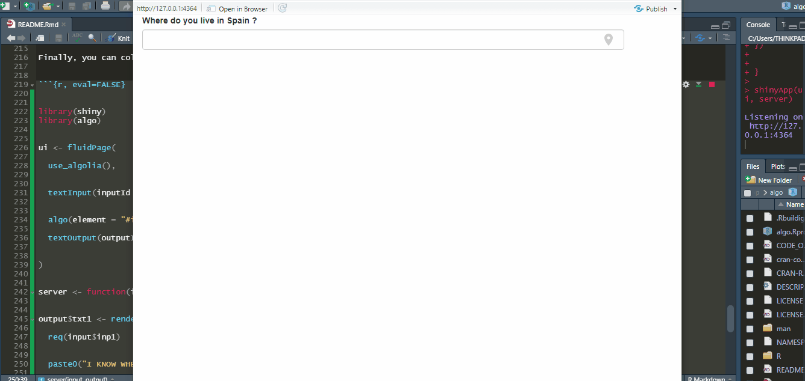

<!-- README.md is generated from README.Rmd. Please edit that file -->

```{r, include = FALSE}
knitr::opts_chunk$set(
  collapse = TRUE,
  comment = "#>",
  fig.path = "man/figures/README-",
  out.width = "100%"
)
```

# algo

<!-- badges: start -->

[](https://cran.r-project.org/package=algo)

[](https://cran.r-project.org/package=algo)

[](https://cran.r-project.org/package=algo)

[](https://cran.r-project.org/package=algo)

[](https://choosealicense.com/licenses/mit/)


[](https://travis-ci.com/feddelegrand7/algo)

[](https://github.com/feddelegrand7/algo)
<!-- badges: end -->

The `algo` package allows you to implement the [Algolia Places](https://community.algolia.com/places/) Address Search Auto Completion Menu on shiny Text Inputs.


## Setup

In order to use the Algolia Places JavaScript library, you'll need create a free [Places](https://community.algolia.com/places/pricing.html) application in which you can get an **ID** and an __API KEY__. When you sign up, you'll be able to run 100,000 requests/month which is quite cool for most users. 

After that, set your credentials within the __.Renviron__ file which can be opened with:  

```{r, eval=FALSE}

# install.packages("usethis")

usethis::edit_r_environ()

```

Then, store the value of your credentials as follows: 

```{r, eval = FALSE}
# These credentials are fakes and used  to give you an idea

ALGOLIA_ID= LSKDFNSFSD  

ALGOLIA_KEY= 29453SKVNEV43T3G3KVEEV


```

Finally, save your .Renviron file, close it and restart your R session. 


## Installation

You can install the `algo` package from [CRAN](https://CRAN.R-project.org/package=algo) with: 

```{r, eval=FALSE}
install.packages("algo")

```


You can install the development version of `algo` from Github with: 


```{r, eval=FALSE}

# install.packages("remotes")

remotes::install_github("feddelegrand7/algo")


```


## How to use the algo package


The `algo` package has two functions: 

+ `use_algolia()`: you must put the `use_algolia()` function at the beginning of your shiny UI. It doesn't take any argument. It only allows you to activate the Algolia Places JavaScript library. 

+ `algo()`: you'll implement an address search auto completion menu on any shiny text input using this function. 


## Example


Let's create a basic shiny application to demonstrate the features of the package: 


```{r, eval = FALSE}

library(shiny)
library(algo)


ui <- fluidPage(
  
  use_algolia(), 
  
  
  textInput(inputId = "inp1", label = "Please introduce your address", width = "800px"), 
  
  
  algo(element = "#inp1", type = "address") # Don't forget to add the # to your ID
  
)


server <- function(input, output) {}

shinyApp(ui, server)

```


Using the `type` argument you can specify which type of geographic information to collect: 


```{r, eval = FALSE}

library(shiny)
library(algo)


ui <- fluidPage(
  
  use_algolia(), 
  
  
  textInput(inputId = "inp1", label = "Please introduce your country", width = "800px"), 
  
  textInput(inputId = "inp2", label = "Now introduce your city", width = "800px"),
  
  
  algo(element = "#inp1", type = "country"), # Don't forget to add the # to your ID
  
  algo(element = "#inp2", type = "city")
  
  
)


server <- function(input, output) {}

shinyApp(ui, server)

```


You can also specify in which country (or countries) you want to get the addresses. This will set a delimitation according to the chosen country:


```{r, eval=FALSE}


library(shiny)
library(algo)


ui <- fluidPage(
  
  use_algolia(), 
  
  
  textInput(inputId = "inp1", label = "Where do you live in Japan ?", width = "800px"), 
  
  
  algo(element = "#inp1", type = "address", countries = "jp") # Don't forget to add the # to your ID
  
  
)


server <- function(input, output) {}

shinyApp(ui, server)

```


Further, you can specify which language should be displayed when collecting the addresses (note that it will only translate partially the addresses): 


```{r, eval=FALSE}


library(shiny)
library(algo)


ui <- fluidPage(
  
  use_algolia(), 
  
  
  textInput(inputId = "inp1", label = "Where do you live in Spain ?", width = "800px"), 
  
  
  algo(element = "#inp1", type = "city", countries = "es", language = "de") # Don't forget to add the # to your ID
  
)


server <- function(input, output) {}

shinyApp(ui, server)

```


Finally, you can collect the addresses the same way as any other shiny inputs: 


```{r, eval=FALSE}


library(shiny)
library(algo)


ui <- fluidPage(
  
  use_algolia(), 
  
  
  textInput(inputId = "inp1", label = "Where do you live in Spain ?", width = "800px"), 
  
  
  algo(element = "#inp1", type = "city", countries = "es", language = "de"), # Don't forget to add the # to your ID
  
  textOutput(outputId = "txt1")
  
  
)


server <- function(input, output) {
  
  
output$txt1 <- renderText({
  
  req(input$inp1)
  
  
  paste0("I KNOW WHERE YOU LIVE O_O:  ", input$inp1)
  
  
})
  
  
}

shinyApp(ui, server)

```




## Code of Conduct

Please note that the algo project is released with a [Contributor Code of Conduct](https://contributor-covenant.org/version/2/0/CODE_OF_CONDUCT.html). By contributing to this project, you agree to abide by its terms.


